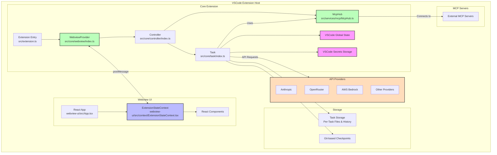

# Cline 扩展架构与开发指南

## 项目概述

Cline 是一个 VSCode 扩展，通过核心扩展后端和基于 React 的 webview 前端相结合，提供 AI 辅助功能。该扩展使用 TypeScript 构建，遵循模块化架构模式。

## 架构概述



## 术语定义

- **核心扩展 (Core Extension)**：src 文件夹内的所有内容，按模块化组件方式组织
- **核心扩展状态 (Core Extension State)**：由 src/core/controller/index.ts 中的 Controller 类管理，作为扩展状态的唯一数据源。它管理多种持久化存储（全局状态、工作区状态和密钥），处理向核心扩展和 webview 组件的状态分发，并协调多个扩展实例之间的状态同步。包括管理 API 配置、任务历史、设置和 MCP 配置。
- **Webview**：webview-ui 文件夹内的所有内容，包括用户看到的所有 React 视图和用户交互组件
- **Webview 状态 (Webview State)**：由 webview-ui/src/context/ExtensionStateContext.tsx 中的 ExtensionStateContext 管理，通过 Context Provider 模式为 React 组件提供对扩展状态的访问。它维护 UI 组件的本地状态，通过消息事件处理实时更新，管理部分消息更新，并提供状态修改方法。上下文包括扩展版本、消息、任务历史、主题、API 配置、MCP 服务器、市场目录和工作区文件路径。它通过 VSCode 的消息传递系统与核心扩展同步，并通过自定义 Hook（useExtensionState）提供类型安全的状态访问。

### 核心扩展架构

核心扩展遵循清晰的层次结构：

1. **WebviewProvider** (src/core/webview/index.ts)：管理 webview 生命周期和通信
2. **Controller** (src/core/controller/index.ts)：处理 webview 消息和任务管理
3. **Task** (src/core/task/index.ts)：执行 API 请求和工具操作

该架构提供了清晰的关注点分离：
- WebviewProvider 专注于 VSCode webview 集成
- Controller 管理状态并协调任务
- Task 处理 AI 请求和工具操作的执行

### WebviewProvider 实现

`src/core/webview/index.ts` 中的 WebviewProvider 类负责：

- 通过静态集合（`activeInstances`）管理多个活动实例
- 处理 webview 生命周期事件（创建、可见性变化、销毁）
- 实现带有正确 CSP 头的 HTML 内容生成
- 支持开发环境下的热模块替换（HMR）
- 设置 webview 与扩展之间的消息监听器

WebviewProvider 维护对 Controller 的引用，并将消息处理委托给它。它还处理侧边栏和标签页面板 webview 的创建，允许 Cline 在 VSCode 的不同上下文中使用。

### 核心扩展状态

`Controller` 类管理多种持久化存储：

- **全局状态 (Global State)**：跨所有 VSCode 实例存储，用于需要全局持久化的设置和数据。
- **工作区状态 (Workspace State)**：特定于当前工作区，用于任务相关的数据和设置。
- **密钥存储 (Secrets)**：用于 API 密钥等敏感信息的安全存储。

`Controller` 处理向核心扩展和 webview 组件的状态分发，同时协调多个扩展实例之间的状态，确保一致性。

实例间的状态同步通过以下方式处理：
- 基于文件的存储，用于任务历史和对话数据
- VSCode 的全局状态 API，用于设置和配置
- 密钥存储，用于敏感信息
- 事件监听器，用于文件变更和配置更新

Controller 实现的方法包括：
- 保存和加载任务状态
- 管理 API 配置
- 处理用户认证
- 协调 MCP 服务器连接
- 管理任务历史和检查点

### Webview 状态

`webview-ui/src/context/ExtensionStateContext.tsx` 中的 `ExtensionStateContext` 为 React 组件提供对扩展状态的访问。它使用 Context Provider 模式并维护 UI 组件的本地状态。上下文包括：

- 扩展版本
- 消息
- 任务历史
- 主题
- API 配置
- MCP 服务器
- 市场目录
- 工作区文件路径

它通过 VSCode 的消息传递系统与核心扩展同步，并通过自定义 Hook（`useExtensionState`）提供类型安全的状态访问。

ExtensionStateContext 处理：
- 通过消息事件进行实时更新
- 流式内容的部分消息更新
- 通过 setter 方法进行状态修改
- 通过自定义 Hook 提供类型安全的状态访问

## API 提供商系统

Cline 通过模块化的 API 提供商系统支持多个 AI 提供商。每个提供商作为 `src/api/providers/` 目录中的独立模块实现，并遵循统一接口。

### API 提供商架构

API 系统由以下部分组成：

1. **API 处理器**：`src/api/providers/` 中的提供商特定实现
2. **API 转换器**：`src/api/transform/` 中的流转换工具
3. **API 配置**：用户设置的 API 密钥和端点
4. **API 工厂**：创建适当处理器的构建函数

主要提供商包括：
- **Anthropic**：与 Claude 模型的直接集成
- **OpenRouter**：支持多个模型提供商的元提供商
- **AWS Bedrock**：与 Amazon AI 服务的集成
- **Gemini**：Google 的 AI 模型
- **Cerebras**：支持 Llama、Qwen 和 DeepSeek 模型的高性能推理
- **Ollama**：本地模型托管
- **LM Studio**：本地模型托管
- **VSCode LM**：VSCode 内置语言模型

### API 配置管理

API 配置以安全方式存储：
- API 密钥存储在 VSCode 的密钥存储中
- 模型选择和非敏感设置存储在全局状态中
- Controller 管理提供商切换和配置更新

系统支持：
- API 密钥的安全存储
- 模型选择和配置
- 自动重试和错误处理
- Token 使用量跟踪和费用计算
- 上下文窗口管理

### 计划/执行模式 API 配置

Cline 支持为计划模式和执行模式分别配置模型：
- 规划和执行可以使用不同的模型
- 系统在切换模式时保留模型选择
- Controller 处理模式间的转换并相应更新 API 配置

## 任务执行系统

Task 类负责执行 AI 请求和工具操作。每个任务在其自己的 Task 类实例中运行，确保隔离和正确的状态管理。

### 任务执行循环

核心任务执行循环遵循以下模式：

```typescript
class Task {
  async initiateTaskLoop(userContent: UserContent, isNewTask: boolean) {
    while (!this.abort) {
      // 1. 发起 API 请求并流式接收响应
      const stream = this.attemptApiRequest()
      
      // 2. 解析并展示内容块
      for await (const chunk of stream) {
        switch (chunk.type) {
          case "text":
            // 解析为内容块
            this.assistantMessageContent = parseAssistantMessageV2(chunk.text)
            // 向用户展示内容块
            await this.presentAssistantMessage()
            break
        }
      }
      
      // 3. 等待工具执行完成
      await pWaitFor(() => this.userMessageContentReady)
      
      // 4. 使用工具结果继续循环
      const recDidEndLoop = await this.recursivelyMakeClineRequests(
        this.userMessageContent
      )
    }
  }
}
```

### 消息流式系统

流式系统处理实时更新和部分内容：

```typescript
class Task {
  async presentAssistantMessage() {
    // 处理流式锁以防止竞态条件
    if (this.presentAssistantMessageLocked) {
      this.presentAssistantMessageHasPendingUpdates = true
      return
    }
    this.presentAssistantMessageLocked = true

    // 展示当前内容块
    const block = this.assistantMessageContent[this.currentStreamingContentIndex]
    
    // 处理不同类型的内容
    switch (block.type) {
      case "text":
        await this.say("text", content, undefined, block.partial)
        break
      case "tool_use":
        // 处理工具执行
        break
    }

    // 如果完成则移动到下一个块
    if (!block.partial) {
      this.currentStreamingContentIndex++
    }
  }
}
```

### 工具执行流程

工具遵循严格的执行模式：

```typescript
class Task {
  async executeToolWithApproval(block: ToolBlock) {
    // 1. 检查自动批准设置
    if (this.shouldAutoApproveTool(block.name)) {
      await this.say("tool", message)
      this.consecutiveAutoApprovedRequestsCount++
    } else {
      // 2. 请求用户批准
      const didApprove = await askApproval("tool", message)
      if (!didApprove) {
        this.didRejectTool = true
        return
      }
    }

    // 3. 执行工具
    const result = await this.executeTool(block)

    // 4. 保存检查点
    await this.saveCheckpoint()

    // 5. 将结果返回给 API
    return result
  }
}
```

### 错误处理与恢复

系统包含健壮的错误处理机制：

```typescript
class Task {
  async handleError(action: string, error: Error) {
    // 1. 检查任务是否已被放弃
    if (this.abandoned) return
    
    // 2. 格式化错误消息
    const errorString = `Error ${action}: ${error.message}`
    
    // 3. 向用户展示错误
    await this.say("error", errorString)
    
    // 4. 将错误添加到工具结果中
    pushToolResult(formatResponse.toolError(errorString))
    
    // 5. 清理资源
    await this.diffViewProvider.revertChanges()
    await this.browserSession.closeBrowser()
  }
}
```

### API 请求与 Token 管理

Task 类处理带有内置重试、流式传输和 Token 管理的 API 请求：

```typescript
class Task {
  async *attemptApiRequest(previousApiReqIndex: number): ApiStream {
    // 1. 等待 MCP 服务器连接
    await pWaitFor(() => this.controllerRef.deref()?.mcpHub?.isConnecting !== true)

    // 2. 管理上下文窗口
    const previousRequest = this.clineMessages[previousApiReqIndex]
    if (previousRequest?.text) {
      const { tokensIn, tokensOut } = JSON.parse(previousRequest.text || "{}")
      const totalTokens = (tokensIn || 0) + (tokensOut || 0)
      
      // 接近上下文限制时截断对话
      if (totalTokens >= maxAllowedSize) {
        this.conversationHistoryDeletedRange = this.contextManager.getNextTruncationRange(
          this.apiConversationHistory,
          this.conversationHistoryDeletedRange,
          totalTokens / 2 > maxAllowedSize ? "quarter" : "half"
        )
      }
    }

    // 3. 处理带自动重试的流式传输
    try {
      this.isWaitingForFirstChunk = true
      const firstChunk = await iterator.next()
      yield firstChunk.value
      this.isWaitingForFirstChunk = false
      
      // 流式传输剩余数据块
      yield* iterator
    } catch (error) {
      // 4. 带重试的错误处理
      if (isOpenRouter && !this.didAutomaticallyRetryFailedApiRequest) {
        await setTimeoutPromise(1000)
        this.didAutomaticallyRetryFailedApiRequest = true
        yield* this.attemptApiRequest(previousApiReqIndex)
        return
      }
      
      // 5. 自动重试失败后询问用户是否重试
      const { response } = await this.ask(
        "api_req_failed",
        this.formatErrorWithStatusCode(error)
      )
      if (response === "yesButtonClicked") {
        await this.say("api_req_retried")
        yield* this.attemptApiRequest(previousApiReqIndex)
        return
      }
    }
  }
}
```

核心特性：

1. **上下文窗口管理**
   - 跨请求跟踪 Token 使用量
   - 需要时自动截断对话
   - 释放空间的同时保留重要上下文
   - 处理不同模型的上下文大小

2. **流式架构**
   - 实时数据块处理
   - 部分内容处理
   - 竞态条件防护
   - 流式传输期间的错误恢复

3. **错误处理**
   - 临时故障的自动重试
   - 持续性问题的用户提示重试
   - 详细的错误报告
   - 失败时的状态清理

4. **Token 跟踪**
   - 每次请求的 Token 计数
   - 累计使用量跟踪
   - 费用计算
   - 缓存命中监控

### 上下文管理系统

上下文管理系统处理对话历史截断，以防止上下文窗口溢出错误。在 `ContextManager` 类中实现，确保长时间运行的对话保持在模型上下文限制内，同时保留关键上下文。

核心特性：

1. **模型感知的大小调整**：根据不同模型的上下文窗口动态调整（DeepSeek 为 64K，大多数模型为 128K，Claude 为 200K）。

2. **主动截断**：监控 Token 使用量，在接近限制时预先截断对话，根据模型维持 27K-40K Token 的缓冲区。

3. **智能保留**：截断时始终保留原始任务消息，并维护用户-助手对话结构。

4. **自适应策略**：根据上下文压力使用不同的截断策略——中等压力时删除一半对话，严重压力时删除四分之三。

5. **错误恢复**：包含对不同提供商上下文窗口错误的专门检测，支持自动重试和需要时更激进的截断。

### 任务状态与恢复

Task 类提供健壮的任务状态管理和恢复能力：

```typescript
class Task {
  async resumeTaskFromHistory() {
    // 1. 加载已保存的状态
    this.clineMessages = await getSavedClineMessages(this.getContext(), this.taskId)
    this.apiConversationHistory = await getSavedApiConversationHistory(this.getContext(), this.taskId)

    // 2. 处理被中断的工具执行
    const lastMessage = this.apiConversationHistory[this.apiConversationHistory.length - 1]
    if (lastMessage.role === "assistant") {
      const toolUseBlocks = content.filter(block => block.type === "tool_use")
      if (toolUseBlocks.length > 0) {
        // 添加被中断的工具响应
        const toolResponses = toolUseBlocks.map(block => ({
          type: "tool_result",
          tool_use_id: block.id,
          content: "Task was interrupted before this tool call could be completed."
        }))
        modifiedOldUserContent = [...toolResponses]
      }
    }

    // 3. 通知中断信息
    const agoText = this.getTimeAgoText(lastMessage?.ts)
    newUserContent.push({
      type: "text",
      text: `[TASK RESUMPTION] This task was interrupted ${agoText}. It may or may not be complete, so please reassess the task context.`
    })

    // 4. 恢复任务执行
    await this.initiateTaskLoop(newUserContent, false)
  }

  private async saveTaskState() {
    // 保存对话历史
    await saveApiConversationHistory(this.getContext(), this.taskId, this.apiConversationHistory)
    await saveClineMessages(this.getContext(), this.taskId, this.clineMessages)
    
    // 创建检查点
    const commitHash = await this.checkpointTracker?.commit()
    
    // 更新任务历史
    await this.controllerRef.deref()?.updateTaskHistory({
      id: this.taskId,
      ts: lastMessage.ts,
      task: taskMessage.text,
      // ... 其他元数据
    })
  }
}
```

任务状态管理的关键方面：

1. **任务持久化**
   - 每个任务有唯一 ID 和专用存储目录
   - 对话历史在每条消息后保存
   - 文件变更通过基于 Git 的检查点跟踪
   - 终端输出和浏览器状态被保留

2. **状态恢复**
   - 任务可以从任何点恢复
   - 被中断的工具执行被优雅处理
   - 文件变更可以从检查点恢复
   - 上下文跨 VSCode 会话保留

3. **工作区同步**
   - 文件变更通过 Git 跟踪
   - 工具执行后创建检查点
   - 状态可以恢复到任何检查点
   - 可以比较检查点之间的变更

4. **错误恢复**
   - 失败的 API 请求可以重试
   - 被中断的工具执行会被标记
   - 资源被正确清理
   - 用户会收到状态变更通知

## 计划/执行模式系统

Cline 实现了将规划与执行分离的双模式系统：

### 模式架构

计划/执行模式系统由以下部分组成：

1. **模式状态**：存储在 Controller 状态中的 `chatSettings.mode`
2. **模式切换**：由 Controller 中的 `togglePlanActModeWithChatSettings` 处理
3. **模式专用模型**：可选配置，为每种模式使用不同的模型
4. **模式专用提示词**：规划和执行使用不同的系统提示词

### 模式切换过程

在模式切换时：

1. 当前模型配置保存到模式专用状态
2. 恢复前一模式的模型配置
3. Task 实例更新为新模式
4. 通知 webview 模式变更
5. 捕获遥测事件用于分析

### 计划模式

计划模式设计用于：
- 信息收集和上下文构建
- 提出澄清问题
- 创建详细的执行计划
- 与用户讨论方案

在计划模式下，AI 使用 `plan_mode_respond` 工具进行对话式规划，而不执行操作。

### 执行模式

执行模式设计用于：
- 执行规划的操作
- 使用工具修改文件、运行命令等
- 实现解决方案
- 提供结果和完成反馈

在执行模式下，AI 可以访问除 `plan_mode_respond` 之外的所有工具，专注于实现而非讨论。

## 数据流与状态管理

### 核心扩展角色

Controller 作为所有持久化状态的唯一数据源。它：
- 管理 VSCode 全局状态和密钥存储
- 协调组件之间的状态更新
- 确保 webview 重新加载时的状态一致性
- 处理任务特定的状态持久化
- 管理检查点的创建和恢复

### 终端管理

Task 类管理终端实例和命令执行：

```typescript
class Task {
  async executeCommandTool(command: string): Promise<[boolean, ToolResponse]> {
    // 1. 获取或创建终端
    const terminalInfo = await this.terminalManager.getOrCreateTerminal(cwd)
    terminalInfo.terminal.show()

    // 2. 执行命令并流式输出
    const process = this.terminalManager.runCommand(terminalInfo, command)
    
    // 3. 处理实时输出
    let result = ""
    process.on("line", (line) => {
      result += line + "\n"
      if (!didContinue) {
        sendCommandOutput(line)
      } else {
        this.say("command_output", line)
      }
    })

    // 4. 等待完成或用户反馈
    let completed = false
    process.once("completed", () => {
      completed = true
    })

    await process

    // 5. 返回结果
    if (completed) {
      return [false, `Command executed.\n${result}`]
    } else {
      return [
        false,
        `Command is still running in the user's terminal.\n${result}\n\nYou will be updated on the terminal status and new output in the future.`
      ]
    }
  }
}
```

核心特性：
1. **终端实例管理**
   - 多终端支持
   - 终端状态跟踪（忙碌/空闲）
   - 进程冷却监控
   - 每个终端的输出历史

2. **命令执行**
   - 实时输出流式传输
   - 用户反馈处理
   - 进程状态监控
   - 错误恢复

### 浏览器会话管理

Task 类通过 Puppeteer 处理浏览器自动化：

```typescript
class Task {
  async executeBrowserAction(action: BrowserAction): Promise<BrowserActionResult> {
    switch (action) {
      case "launch":
        // 1. 以固定分辨率启动浏览器
        await this.browserSession.launchBrowser()
        return await this.browserSession.navigateToUrl(url)

      case "click":
        // 2. 处理坐标点击操作
        return await this.browserSession.click(coordinate)

      case "type":
        // 3. 处理键盘输入
        return await this.browserSession.type(text)

      case "close":
        // 4. 清理资源
        return await this.browserSession.closeBrowser()
    }
  }
}
```

关键方面：
1. **浏览器控制**
   - 固定 900x600 分辨率窗口
   - 每个任务生命周期单实例
   - 任务完成时自动清理
   - 控制台日志捕获

2. **交互处理**
   - 基于坐标的点击
   - 键盘输入模拟
   - 屏幕截图捕获
   - 错误恢复

## MCP（模型上下文协议）集成

### MCP 架构

MCP 系统由以下部分组成：

1. **McpHub 类**：`src/services/mcp/McpHub.ts` 中的核心管理器
2. **MCP 连接**：管理与外部 MCP 服务器的连接
3. **MCP 设置**：存储在 JSON 文件中的配置
4. **MCP 市场**：可用 MCP 服务器的在线目录
5. **MCP 工具与资源**：已连接服务器公开的能力

McpHub 类：
- 管理 MCP 服务器连接的生命周期
- 通过设置文件处理服务器配置
- 提供调用工具和访问资源的方法
- 实现 MCP 工具的自动批准设置
- 监控服务器健康状态并处理重连

### MCP 服务器类型

Cline 支持两种类型的 MCP 服务器连接：
- **Stdio**：基于命令行的服务器，通过标准 I/O 通信
- **SSE**：基于 HTTP 的服务器，通过服务器发送事件（Server-Sent Events）通信

### MCP 服务器管理

McpHub 类提供以下方法：
- 发现和连接 MCP 服务器
- 监控服务器健康状态
- 必要时重启服务器
- 管理服务器配置
- 设置超时和自动批准规则

### MCP 工具集成

MCP 工具集成到任务执行系统中：
- 工具在连接时被发现和注册
- Task 类可以通过 McpHub 调用 MCP 工具
- 工具结果被流式返回给 AI
- 自动批准设置可以按工具配置

### MCP 市场

MCP 市场提供：
- 可用 MCP 服务器目录
- 一键安装
- README 预览
- 服务器状态监控

Controller 类通过 McpHub 服务管理 MCP 服务器：

```typescript
class Controller {
  mcpHub?: McpHub

  constructor(context: vscode.ExtensionContext, webviewProvider: WebviewProvider) {
    this.mcpHub = new McpHub(this)
  }

  async downloadMcp(mcpId: string) {
    // 从市场获取服务器详情
    const response = await axios.post<McpDownloadResponse>(
      "https://api.cline.bot/v1/mcp/download",
      { mcpId },
      {
        headers: { "Content-Type": "application/json" },
        timeout: 10000,
      }
    )

    // 使用 README 上下文创建任务
    const task = `Set up the MCP server from ${mcpDetails.githubUrl}...`

    // 初始化任务并显示聊天视图
    await this.initClineWithTask(task)
  }
}
```

## 总结

本指南全面概述了 Cline 扩展架构，特别关注状态管理、数据持久化和代码组织。遵循这些模式可确保在扩展各组件之间实现健壮的功能实现和正确的状态处理。

请记住：
- 始终在扩展中持久化重要状态
- 核心扩展遵循 WebviewProvider -> Controller -> Task 的流程
- 对所有状态和消息使用正确的类型定义
- 处理错误和边界情况
- 测试 webview 重新加载时的状态持久化
- 遵循已建立的模式以保持一致性
- 将新代码放在适当的目录中
- 保持清晰的关注点分离
- 在正确的 package.json 中安装依赖

## 贡献

欢迎为 Cline 扩展做出贡献！请遵循以下指南：

添加新工具或 API 提供商时，请分别遵循 `src/integrations/` 和 `src/api/providers/` 目录中的现有模式。确保代码文档完善，并包含适当的错误处理。

`.clineignore` 文件允许用户指定 Cline 不应访问的文件和目录。实现新功能时，请遵守 `.clineignore` 规则，确保代码不会尝试读取或修改被忽略的文件。
